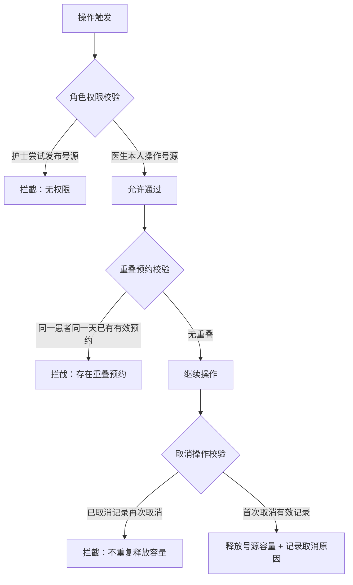

## 1. 产品概述

本地门诊复诊排班与补号协同系统，解决门诊复诊过程中号源管理、患者预约、多角色协同的核心问题。系统覆盖从复诊申请到预约确认的完整闭环，支持护士分诊、医生放号、患者确认等多角色操作，并提供预约记录查询与数据导出能力。

- 目标用户：门诊护士、出诊医生、复诊患者
- 核心价值：规范复诊流程、避免号源冲突、保留操作审计、提升协同效率

## 2. 核心特性

### 2.1 用户角色

| 角色 | 登录方式 | 核心权限 |
|------|----------|----------|
| 护士(分诊台) | 模拟角色切换 | 提交复诊申请、分诊确认、查看所有复诊单、取消预约 |
| 医生 | 模拟角色切换 | 发布号源(设置排班容量)、查看本人号源、查看分配给自己的复诊单 |
| 患者 | 模拟角色切换 | 查看本人复诊单、确认/取消预约、查看预约记录 |

### 2.2 功能模块

1. **仪表盘/概览页**：号源容量统计、今日预约概览、待办提醒
2. **复诊申请页**：护士录入患者复诊申请，选择目标医生
3. **分诊确认页**：护士对复诊申请进行分诊确认，分配具体号源时段
4. **医生号源管理页**：医生维护个人排班，发布号源容量(仅医生可操作)
5. **患者确认页**：患者查看待确认预约，进行确认或取消
6. **预约记录查询页**：多条件查询预约记录，查看状态历史与取消原因
7. **数据导出页**：导出预约记录为 CSV / JSON 格式

### 2.3 页面详情

| 页面名称 | 模块名称 | 功能描述 |
|----------|----------|----------|
| 仪表盘 | 统计卡片 | 显示总号源数、已用号源、待分诊数、待确认数 |
| 仪表盘 | 角色切换器 | 快速切换护士/医生/患者角色体验不同视角 |
| 仪表盘 | 近期活动 | 展示最近操作时间线 |
| 复诊申请页 | 申请表单 | 患者姓名、身份证/病历号、联系方式、目标科室、目标医生、复诊原因、期望日期 |
| 复诊申请页 | 表单校验 | 必填项提示、格式校验、错误信息可见 |
| 分诊确认页 | 复诊单列表 | 显示待分诊/已分诊复诊单，支持筛选 |
| 分诊确认页 | 分诊操作 | 为复诊单分配具体医生号源时段，显示号源剩余容量 |
| 医生号源管理页 | 排班列表 | 按日期展示医生排班与号源容量 |
| 医生号源管理页 | 发布号源 | 医生新增排班：日期、时段(上午/下午)、号源总数(仅医生本人可操作) |
| 患者确认页 | 待确认列表 | 患者查看待确认预约，展示医生、时间、地点 |
| 患者确认页 | 确认/取消 | 确认预约或取消(需填写取消原因) |
| 预约记录查询页 | 高级筛选 | 按患者、医生、日期、状态多维度筛选 |
| 预约记录查询页 | 状态历史 | 点击记录查看完整状态变更历史(操作人、时间、备注) |
| 预约记录查询页 | 取消原因 | 已取消记录展示取消原因与释放容量信息 |
| 数据导出页 | 格式选择 | CSV / JSON 导出，可按筛选条件导出 |

## 3. 核心流程

复诊申请由护士发起，分诊确认后分配到医生号源，医生预先发布排班号源，患者收到预约后进行确认，最终形成有效预约记录，全程状态可追溯。

```mermaid
flowchart TD
    A["护士提交复诊申请"] --> B["状态：待分诊"]
    B --> C["护士分诊确认"]
    C --> D["状态：待放号/待确认"]
    E["医生发布号源排班"] --> F["号源池(容量管理)"]
    D --> G["分配号源(扣减容量)"]
    G --> H["状态：待患者确认"]
    H --> I{"患者操作"}
    I -->|确认预约| J["状态：已确认"]
    I -->|取消预约(填写原因)| K["状态：已取消\n释放号源容量"]
    J --> L["查询预约记录\n查看状态历史"]
    K --> L
```

### 边界约束流程



## 4. 用户界面设计

### 4.1 设计风格

- **主色调**：医疗蓝 `#2563EB`，辅以青绿色 `#0D9488` 表示成功，琥珀色 `#D97706` 表示待办，红色 `#DC2626` 表示取消/错误
- **中性色**：石板灰系列 `slate.50 ~ slate.900`，营造专业医疗氛围
- **按钮风格**：圆角 `rounded-lg`，带轻微阴影，hover 时微抬升 + 阴影加深
- **字体**：标题使用 `Noto Serif SC` 衬线体体现专业感，正文使用 `Noto Sans SC`
- **布局风格**：卡片式布局 + 左侧导航栏，清晰分区
- **图标风格**：使用 lucide-react 线性图标，统一 20px 尺寸

### 4.2 页面设计概览

| 页面名称 | 模块名称 | UI 元素 |
|----------|----------|---------|
| 全局布局 | 导航栏 | 左侧深色导航栏，带图标；顶部面包屑 + 角色切换标签 |
| 仪表盘 | 统计卡片 | 渐变背景卡片，大号数字 + 副标题 + 趋势箭头；悬浮时微放大 |
| 表单页面 | 表单区域 | 白色卡片，浅灰边框，标签左对齐，错误红色提示文字 |
| 列表页面 | 数据表格 | 斑马纹行，状态徽章(不同颜色)，操作按钮列 |
| 详情模态框 | 状态时间线 | 垂直时间线展示状态历史，节点带彩色圆点 |

### 4.3 响应式

- 桌面端优先：最小支持 1280px 宽度
- 平板适配：导航栏折叠为图标模式
- 移动端：导航变为底部 Tab 栏，表格换为卡片列表

### 4.4 细节交互

- 页面加载：骨架屏 `animate-pulse`
- 状态徽章：`rounded-full` 胶囊样式，不同状态配不同背景色
- 操作反馈：按钮点击有 `scale(0.97)` 缩放反馈
- 表单错误：输入框边框变红，下方 12px 红色错误提示文字
- 时间线：状态节点左侧竖线连接，当前节点高亮脉冲
