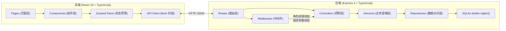
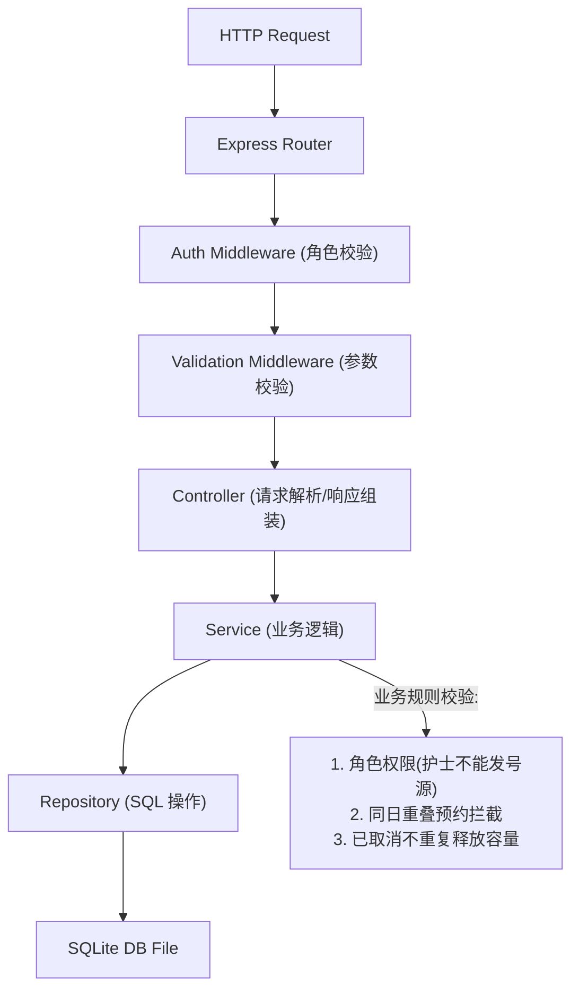
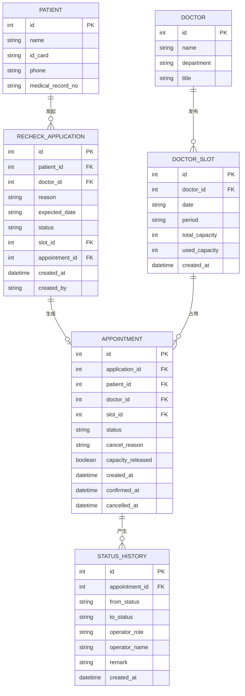

## 1. 架构设计



## 2. 技术描述

- **前端**：React@18 + TypeScript + Vite@6 + TailwindCSS@3 + Zustand@4 + React Router@6 + lucide-react
- **后端**：Express@4 + TypeScript + better-sqlite3 (同步 SQLite 驱动)
- **初始化工具**：vite-init（react-express-ts 模板）
- **数据库**：SQLite（本地文件存储，无需额外服务，重启数据不丢失）
- **数据导出**：服务端生成 CSV / JSON 流式下载

## 3. 路由定义

### 前端路由

| 路由 | 用途 |
|------|------|
| / | 仪表盘概览 |
| /applications | 复诊申请列表与新建 |
| /triage | 分诊确认工作台 |
| /slots | 医生号源管理 |
| /confirm | 患者预约确认 |
| /records | 预约记录查询 |
| /export | 数据导出 |

### 后端 API 路由

| 方法 | 路径 | 用途 |
|------|------|------|
| GET | /api/doctors | 获取医生列表 |
| GET | /api/patients | 获取患者列表 |
| GET | /api/slots | 获取号源列表（支持按医生/日期筛选） |
| POST | /api/slots | 医生发布号源（权限校验：仅医生本人） |
| GET | /api/applications | 获取复诊申请列表 |
| POST | /api/applications | 新建复诊申请 |
| POST | /api/applications/:id/triage | 分诊确认（分配号源） |
| GET | /api/appointments | 获取预约记录 |
| POST | /api/appointments/:id/confirm | 患者确认预约 |
| POST | /api/appointments/:id/cancel | 取消预约（记录原因，释放容量） |
| GET | /api/appointments/:id/history | 获取预约状态历史 |
| GET | /api/export/csv | 导出 CSV |
| GET | /api/export/json | 导出 JSON |
| GET | /api/stats/overview | 仪表盘统计数据 |

## 4. API 类型定义

```typescript
// 共享类型定义 (shared/types.ts)

export type UserRole = 'nurse' | 'doctor' | 'patient';

export interface Doctor {
  id: number;
  name: string;
  department: string;
  title: string;
}

export interface Patient {
  id: number;
  name: string;
  idCard: string;
  phone: string;
  medicalRecordNo: string;
}

export type SlotPeriod = 'morning' | 'afternoon';

export interface DoctorSlot {
  id: number;
  doctorId: number;
  date: string; // YYYY-MM-DD
  period: SlotPeriod;
  totalCapacity: number;
  usedCapacity: number;
  createdAt: string;
}

export type ApplicationStatus = 'pending_triage' | 'traged' | 'pending_confirm' | 'confirmed' | 'cancelled';

export interface RecheckApplication {
  id: number;
  patientId: number;
  doctorId: number;
  reason: string;
  expectedDate: string;
  status: ApplicationStatus;
  slotId: number | null;
  appointmentId: number | null;
  createdAt: string;
  createdBy: string;
}

export interface Appointment {
  id: number;
  applicationId: number;
  patientId: number;
  doctorId: number;
  slotId: number;
  status: 'pending_confirm' | 'confirmed' | 'cancelled';
  cancelReason: string | null;
  capacityReleased: boolean;
  createdAt: string;
  confirmedAt: string | null;
  cancelledAt: string | null;
}

export interface StatusHistory {
  id: number;
  appointmentId: number;
  fromStatus: string | null;
  toStatus: string;
  operatorRole: UserRole;
  operatorName: string;
  remark: string | null;
  createdAt: string;
}

// 请求/响应
export interface CreateApplicationReq {
  patientId: number;
  doctorId: number;
  reason: string;
  expectedDate: string;
}

export interface CreateSlotReq {
  doctorId: number;
  date: string;
  period: SlotPeriod;
  totalCapacity: number;
}

export interface TriageReq {
  slotId: number;
}

export interface CancelAppointmentReq {
  reason: string;
}

export interface ApiResponse<T> {
  success: boolean;
  data?: T;
  error?: string;
  errors?: Record<string, string>;
}
```

## 5. 服务端架构图



## 6. 数据模型

### 6.1 ER 图



### 6.2 DDL 与初始数据

```sql
-- 医生表
CREATE TABLE IF NOT EXISTS doctor (
  id INTEGER PRIMARY KEY AUTOINCREMENT,
  name TEXT NOT NULL,
  department TEXT NOT NULL,
  title TEXT NOT NULL
);

-- 患者表
CREATE TABLE IF NOT EXISTS patient (
  id INTEGER PRIMARY KEY AUTOINCREMENT,
  name TEXT NOT NULL,
  id_card TEXT NOT NULL UNIQUE,
  phone TEXT NOT NULL,
  medical_record_no TEXT NOT NULL UNIQUE
);

-- 医生号源表
CREATE TABLE IF NOT EXISTS doctor_slot (
  id INTEGER PRIMARY KEY AUTOINCREMENT,
  doctor_id INTEGER NOT NULL,
  date TEXT NOT NULL,
  period TEXT NOT NULL CHECK(period IN ('morning','afternoon')),
  total_capacity INTEGER NOT NULL,
  used_capacity INTEGER NOT NULL DEFAULT 0,
  created_at TEXT NOT NULL DEFAULT (datetime('now')),
  FOREIGN KEY (doctor_id) REFERENCES doctor(id),
  UNIQUE(doctor_id, date, period)
);

-- 复诊申请表
CREATE TABLE IF NOT EXISTS recheck_application (
  id INTEGER PRIMARY KEY AUTOINCREMENT,
  patient_id INTEGER NOT NULL,
  doctor_id INTEGER NOT NULL,
  reason TEXT NOT NULL,
  expected_date TEXT NOT NULL,
  status TEXT NOT NULL DEFAULT 'pending_triage',
  slot_id INTEGER,
  appointment_id INTEGER,
  created_at TEXT NOT NULL DEFAULT (datetime('now')),
  created_by TEXT NOT NULL,
  FOREIGN KEY (patient_id) REFERENCES patient(id),
  FOREIGN KEY (doctor_id) REFERENCES doctor(id),
  FOREIGN KEY (slot_id) REFERENCES doctor_slot(id)
);

-- 预约表
CREATE TABLE IF NOT EXISTS appointment (
  id INTEGER PRIMARY KEY AUTOINCREMENT,
  application_id INTEGER NOT NULL,
  patient_id INTEGER NOT NULL,
  doctor_id INTEGER NOT NULL,
  slot_id INTEGER NOT NULL,
  status TEXT NOT NULL DEFAULT 'pending_confirm',
  cancel_reason TEXT,
  capacity_released INTEGER NOT NULL DEFAULT 0,
  created_at TEXT NOT NULL DEFAULT (datetime('now')),
  confirmed_at TEXT,
  cancelled_at TEXT,
  FOREIGN KEY (application_id) REFERENCES recheck_application(id),
  FOREIGN KEY (patient_id) REFERENCES patient(id),
  FOREIGN KEY (doctor_id) REFERENCES doctor(id),
  FOREIGN KEY (slot_id) REFERENCES doctor_slot(id)
);

-- 状态历史表
CREATE TABLE IF NOT EXISTS status_history (
  id INTEGER PRIMARY KEY AUTOINCREMENT,
  appointment_id INTEGER NOT NULL,
  from_status TEXT,
  to_status TEXT NOT NULL,
  operator_role TEXT NOT NULL,
  operator_name TEXT NOT NULL,
  remark TEXT,
  created_at TEXT NOT NULL DEFAULT (datetime('now')),
  FOREIGN KEY (appointment_id) REFERENCES appointment(id)
);

-- 索引
CREATE INDEX IF NOT EXISTS idx_slot_doctor_date ON doctor_slot(doctor_id, date);
CREATE INDEX IF NOT EXISTS idx_appt_patient_date ON appointment(patient_id, slot_id);
CREATE INDEX IF NOT EXISTS idx_appt_status ON appointment(status);
CREATE INDEX IF NOT EXISTS idx_history_appt ON status_history(appointment_id);

-- 初始样例：医生
INSERT INTO doctor (name, department, title) VALUES
  ('张伟明', '心内科', '主任医师'),
  ('李雪华', '内分泌科', '副主任医师'),
  ('王建国', '骨科', '主治医师');

-- 初始样例：患者
INSERT INTO patient (name, id_card, phone, medical_record_no) VALUES
  ('陈大海', '110101198001011234', '13800138001', 'MR20240001'),
  ('刘小美', '110101199203054567', '13800138002', 'MR20240002'),
  ('赵强', '110101197508127890', '13800138003', 'MR20240003');
```
